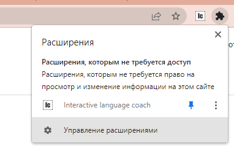

# Chrome extension.
## Interactive language-learning helper.

It's your vocabulary-book built-in any pages you visit. 

You can interactively add, edit and mark words.
Marked words will take one of selected list of colors and turn into vocabulary card right in your browser!

#### How it works? 

No more necessary to create vocabulary cards for learning language by you own.  
Just read complex documents, books or whatever you like.  
Click on words and add them into your wordbook.  

Set your baseline familiarity with the word, start notice them more and move between levels when feel your knowledge. 

Save time learning new words by making it automatic!

## Build guide

1. Download dependencies and init npm project `npm install` 

2. Change url in packege.json `"build": "DISC://full_patch/node_modules/.bin/webpack"`  
 Where `disc` it's your drive   and `full_patch` it's your full patch to project. 
   

3. Use `npm run build`, so you create 2 runnable files.  
   `page/page.ts` and `popup/popup.ts`

4. Go to your browser and open `chrome://extensions/`, or you can click here:

  
 
5. Click `select unpackedge extension` and open dir where you have `manifest.json`

   
##6. DONE! Try to use it!

## Updates History:

#### ~0.1.5-0.1.6 - Preview

#### 0.2.0 - First working prototype
- Redesigned popup menu (preparing to collections)
- Speeded up parser (become at least in 2 times faster)
- Added `instantly create terms button` on google translate page
- Fixed list of bugs

#### 0.2.7 - Returned to development
- Add docs, comments and TODO's for start.js, move file to from `./parser` to `./scripts`

#### 0.2.8 - 2.2.9
- Add docs and empty files (mocks and constants) to prepare for future refactor
- Impl new page parser script (without text parser and page builder scripts)

#### 0.3.0 - Clean parser and original form builder
- Make text parser and page buildr scripts
- Increased the speed of algorithm execution
- Made the page build in its original form
- Used mock WORDBOOK and mocks.js file
- Off google translator script, that produce able to add words

#### 0.3.1 - Critical parsing bugfix
- Fix images, video and other media parsing

#### 0.3.6 - Migration to OOP
- Move all page files into classes. Except start.js and mocks.js
- Added popup words. It's can't change real data, but the front is done.
- Some small changes in mocks.js and other scripts.

#### 0.3.8 - Fix Builder
- Builder doesn't break pseudo-element "before" anymore

#### 0.3.9 - Wordbook migration

#### 0.4.0 - Webpack and modules

#### 0.4.2 - Adding words by click

#### 0.4.4 - Single page apps support

#### 0.4.5 - Chrome's popup window

