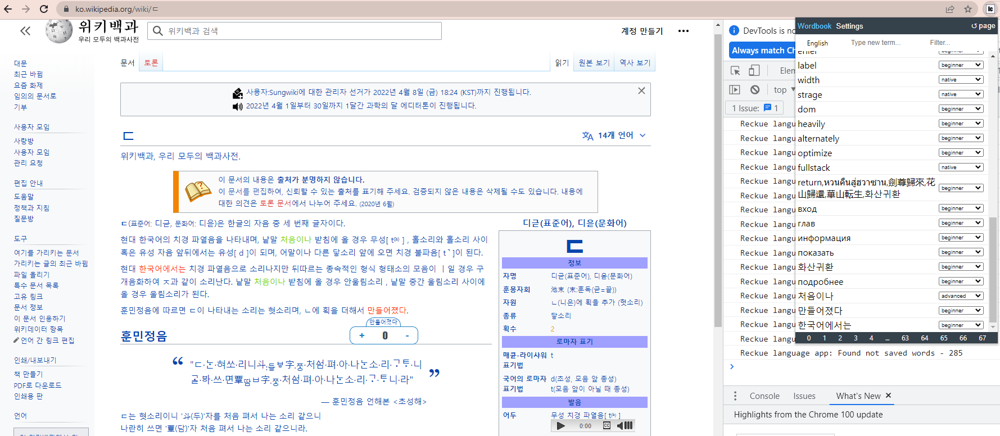
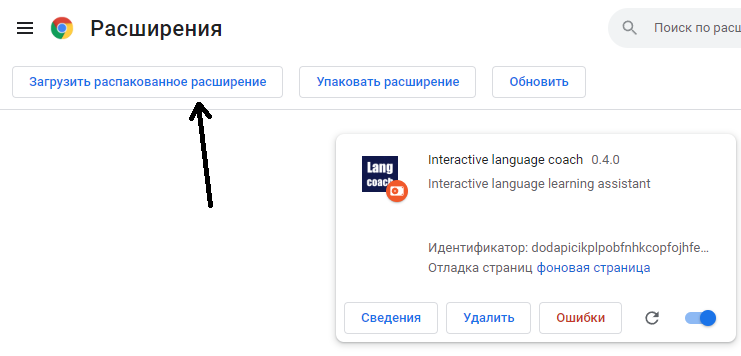

# Reckue Langs - Chrome Extinction
## Vacabulary Assistant – Learn New Words as You Browse

[](https://opensource.org/licenses/MIT)  
[](https://github.com/Reckue/reckue-langs) 
[](CONTRIBUTING.md)  
[](https://github.com/Reckue/reckue-langs/issues)

## What is Vacabulary Assistant?
Vacabulary Assistant is an **interactive vocabulary builder** that helps you collect and organize new words effortlessly while browsing the web. With just a click, you can **save words**, **highlight them**, and **track your learning progress** directly in your browser. Marked words take on customizable colors and transform into interactive vocabulary cards.

### How It Works
Forget about manually creating vocabulary cards—**Vacabulary Assistant does it for you!** Just browse the web as usual, reading articles, books, or any content. Whenever you come across a word you want to remember, **click on it** to add it to your personal wordbook.

As you continue learning, you can **track your progress**, **improve retention**, and **level up your vocabulary effortlessly**. Vacabulary Assistant streamlines language learning, making it seamless and automatic, so you can focus on mastering new words efficiently.

🚀 **Key Features:**  
✔️ Save words instantly from any webpage  
✔️ Highlight words in custom colors  
✔️ Automatically turn words into vocabulary cards  
✔️ Track progress and enhance retention  

🔧 **Installation & Usage**  
Get started in minutes! Follow the [Build Guide](#build-guide) to install and set up the extension.

<div style="border: 1px #1e81c6 solid; border-radius: 10px; background: #acd1ff">



</div>

## 🛠 Build & Installation Guide

Follow these simple steps to set up **Vacabulary Assistant** in your browser. No prior experience required! 🚀

### **1️⃣ Install Dependencies**
Open a terminal and run the following command to install all required dependencies:
```sh  
npm install --legacy-peer-deps
```

### **2️⃣ Build the Extension**

**Для разработки и отладки:**
```sh  
npm run dev  
```
Это создаст файлы с source maps для отладки:
- `dist/page/page.js` + `dist/page/page.js.map`
- `dist/popup/popup.js` + `dist/popup/popup.js.map`
- `dist/popup/popup.html`

**Для production:**
```sh  
npm run build:prod  
```
Это создаст минифицированные файлы для продакшена.

### **3️⃣ Enable Developer Mode in Chrome**
1. Open Google Chrome and navigate to:  
   🔗 `chrome://extensions/`
2. Toggle the **Developer mode** switch (usually in the top-right corner).

### **4️⃣ Load the Unpacked Extension**
1. Click **"Load unpacked"**.
2. Select the folder where your `manifest.json` file is located.



### **5️⃣ Test the Extension**
- Open any webpage and try selecting a word.
- You should see an option to save it to your vocabulary list.
- Open the extension popup to view and manage your saved words.

### **6️⃣ Debugging 🔧**

**Для отладки ошибок:**
1. Используйте `npm run dev` для сборки с source maps
2. Откройте DevTools в Chrome (F12)
3. Перейдите на вкладку Sources
4. Найдите файлы в папке `webpack://` → `src/`
5. Установите breakpoints для отладки

**Пример отладки ошибки:**
```javascript
// Вместо минифицированного кода:
// TypeError: e.getBoundingClientRect is not a function at page.js:1:36036

// Теперь вы увидите исходный код:
// TypeError: e.getBoundingClientRect is not a function at ApiPageService.js:45:12
```

### **7️⃣ You're All Set! 🎉**
Your **Vacabulary Assistant** extension is now installed and ready to help you expand your vocabulary! If you encounter any issues, check the [GitHub Issues](https://github.com/Reckue/reckue-langs/issues) page or contribute improvements.

## Updates History:

#### ~0.1.5-0.1.6 - Preview


#### 0.2.0 - First working prototype
- Redesigned popup menu (preparing for collections)
- Optimized parsing speed (2x faster)
- Added instant word-saving button on Google Translate
- Fixed various bugs

#### 0.2.7 - Development resumed
- Added documentation, comments, and TODOs
- Moved `start.js` from `./parser` to `./scripts`

#### 0.3.0 - Improved parser and form builder
- Enhanced text parsing and page building
- Increased algorithm efficiency
- Implemented mock wordbook and `mocks.js`

#### 0.3.6 - Migration to OOP
- Refactored files into classes
- Added interactive popup words feature

#### 0.4.5 - Chrome popup window support

...and more improvements coming soon!