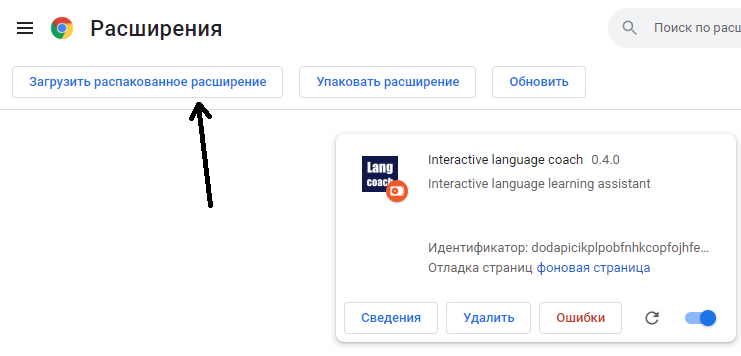

# Reckue Langs - Chrome Extinction
## Vacabulary Assistant – Learn New Words as You Browse

  
  
  

## What is Vacabulary Assistant?
Vacabulary Assistant is an **interactive vocabulary builder** that helps you collect and organize new words effortlessly while browsing the web. With just a click, you can **save words**, **highlight them**, and **track your learning progress** directly in your browser. Marked words take on customizable colors and transform into interactive vocabulary cards.

### How It Works
Forget about manually creating vocabulary cards—**Vacabulary Assistant does it for you!** Just browse the web as usual, reading articles, books, or any content. Whenever you come across a word you want to remember, **click on it** to add it to your personal wordbook.

As you continue learning, you can **track your progress**, **improve retention**, and **level up your vocabulary effortlessly**. Vacabulary Assistant streamlines language learning, making it seamless and automatic, so you can focus on mastering new words efficiently.

🚀 **Key Features:**  
✔️ Save words instantly from any webpage  
✔️ Highlight words in custom colors  
✔️ Automatically turn words into vocabulary cards  
✔️ Track progress and enhance retention  

🔧 **Installation & Usage**  
Get started in minutes! Follow the [Build Guide](#build-guide) to install and set up the extension.

## Build guide

1. Download dependencies and initialize the npm project using `npm install`.

2. Build the extension using `npm run build`. This will generate two runnable files:  
   `page/page.ts` and `popup/popup.ts`.

3. Open your browser and navigate to `chrome://extensions/`.

4. Enable developer mode and load the unpacked extension from the directory containing `manifest.json`.

## Updates History:

#### ~0.1.5-0.1.6 - Preview

#### 0.2.0 - First working prototype
- Redesigned popup menu (preparing for collections)
- Optimized parsing speed (2x faster)
- Added instant word-saving button on Google Translate
- Fixed various bugs

#### 0.2.7 - Development resumed
- Added documentation, comments, and TODOs
- Moved `start.js` from `./parser` to `./scripts`

#### 0.3.0 - Improved parser and form builder
- Enhanced text parsing and page building
- Increased algorithm efficiency
- Implemented mock wordbook and `mocks.js`

#### 0.3.6 - Migration to OOP
- Refactored files into classes
- Added interactive popup words feature

#### 0.4.5 - Chrome popup window support

...and more improvements coming soon!